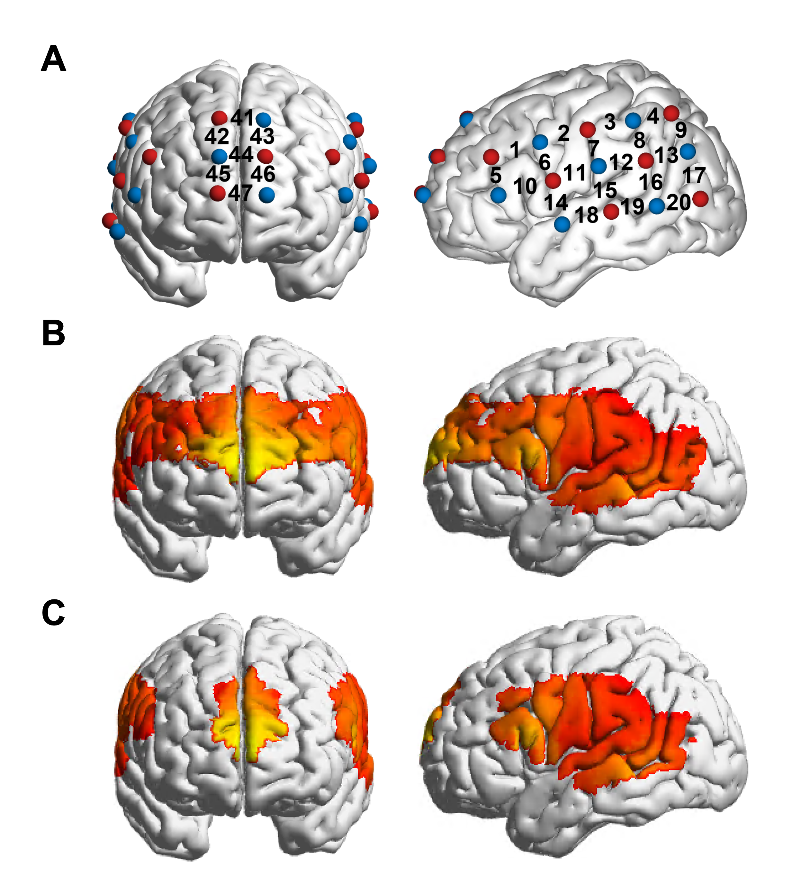
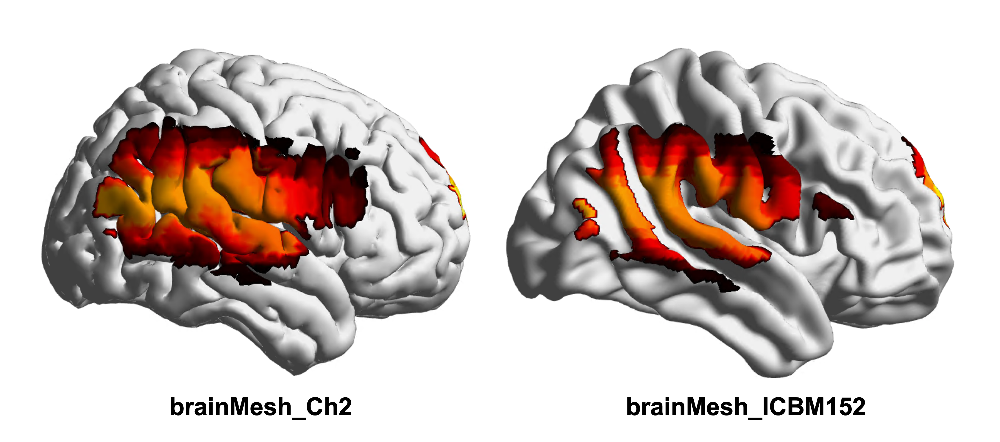
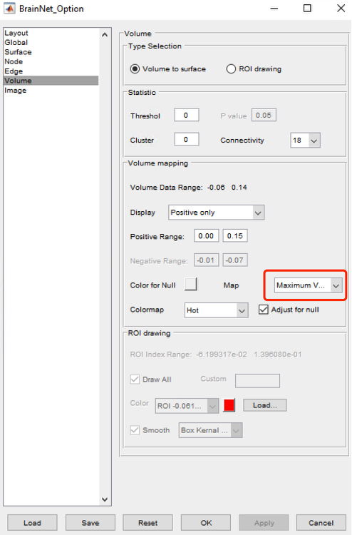

# nirs数据投影到fmri空间

对于single brain或者channel-aligned的hyperscanning研究，出于数据可视化目的，往往希望将fnirs数据结果呈现在fMRI图像上。本文将介绍具体实现方式。

首先我们定义一些概念：
+ MNI坐标：描述fmri图像空间位置的坐标系统。
+ channel：通过一个发射极和一个接受极测量某一MNI坐标附近皮层脑活动的通道。
+ set：包含了一组相邻channel的光极板。很多研究都会放置多个光极板，最常见的是左侧一个右侧一个。
+ layout: 整个实验的channel排布方式。如用多少set放置多少channel放置在哪里。

## 获取channel的MNI坐标

首先我们需要知道每个channel在皮层上的MNI坐标。不同设备有不同的方法，此处不再赘述。但一定要注意channel的MNI坐标是皮层附近的而不是脑壳附近的。

## 使用nirs2img_multi函数投影

该函数改进自Cui Xu老师开发的nirs2img函数。

针对存在多个set的layout(如图A)，原始的nirs2img函数在插补多个set时可能会出现过度插补的伪迹，同时也不能插补单一channel(如图B)。nirs2img_multi主要用于解决这一问题。

nirs2img_multi的使用方式与nirs2img基本相同，除了输入文件名、mni坐标、每个channel激活值以及是否插补外，只需要单独再输入每个channel属于哪个set即可。

比如在本文示例的layout中，输入一个前40个元素为1，后7个元素为2的数组即可：

`set = [1 1 1 1 1 1 1 1 1 1 1 1 1 1 1 1 1 1 1 1 1 1 1 1 1 1 1 1 1 1 1 1 1 1 1 1 1 1 1 1 2 2 2 2 2 2 2]`

运行函数后会生成一个nii和img文件到当前文件夹下。可以看到生成的图像去掉了set之间的伪迹(图C)。

## 使用软件可视化

获取fmri图像之后我们就可以使用一些常用软件进行可视化操作了。常用的操作较为便捷的软件有[xjview](https://www.alivelearn.net/xjview/)，[brainNet viewer](https://www.nitrc.org/projects/bnv/)等。这里以brainNet viewer为例。

在导入img或hdr文件后，选定模板时推荐使用BrainMesh_Ch2.nv。因为nirs2img_multi函数并不能投影到脑沟只能投影到脑回，所以使用其他模板可能会出现断裂（如下图）。

在BrianNet viewer的【Option】→【Volume】的插值设置中，可以综合考虑合理性和美观性进行调整，这里推荐一些我认为比较合适的选项：

- Average voxel
- Maximum voxel
- Extremum voxel

